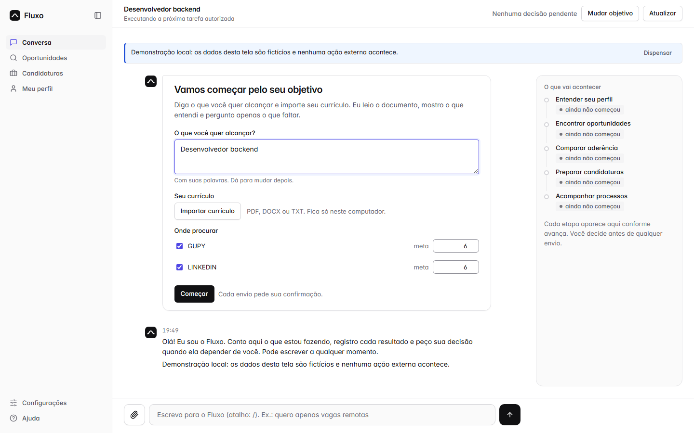
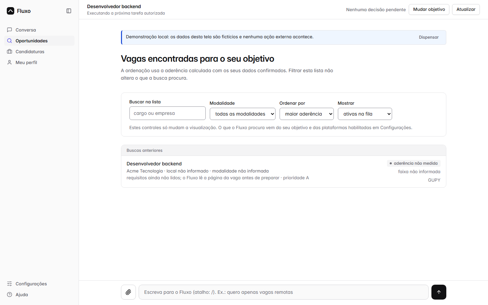
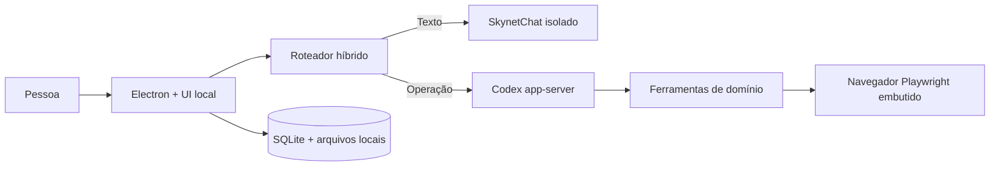
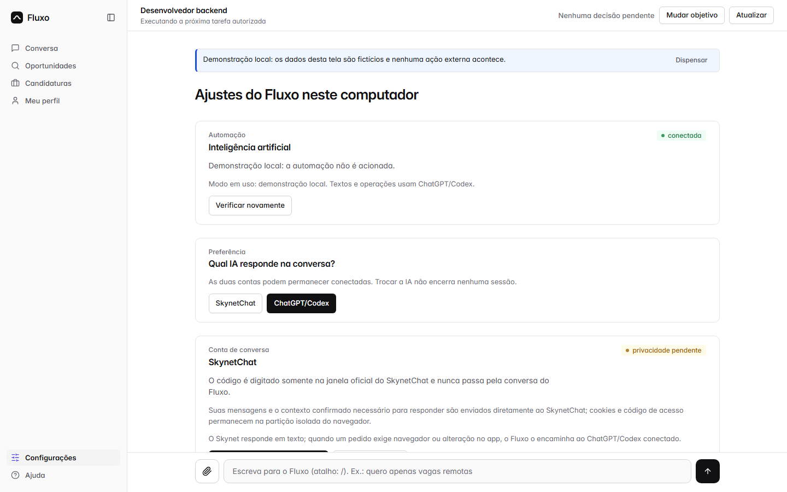

# Fluxo

[](https://github.com/DeckDev-RC/fluxo-candidaturas-codex/actions/workflows/ci.yml)
[](LICENSE)
[](https://github.com/DeckDev-RC/fluxo-candidaturas-codex/releases/latest)

Aplicativo Windows local-first para organizar e conduzir candidaturas de emprego
com IA, navegador integrado, confirmação humana e rastreabilidade.

O Fluxo combina **SkynetChat para conversa textual** e **ChatGPT/Codex para
operações**. A pessoa pode manter as duas sessões conectadas e escolher qual IA
responde. Ações externas sensíveis nunca são aprovadas pelo modelo: dependem de
uma decisão autenticada e vinculada à ação exata.

> English summary: Fluxo is an Apache-2.0, local-first Windows application for
> supervised job applications with hybrid AI, embedded browser automation and
> human approval gates.



## Por que este projeto existe

Buscar emprego mistura tarefas repetitivas, dados pessoais, formulários,
decisões sensíveis e acompanhamento em vários sites. O Fluxo centraliza esse
trabalho sem transformar o perfil da pessoa em um serviço SaaS:

- perfil, currículo, fila e histórico ficam na pasta local escolhida;
- o navegador das plataformas aparece dentro do aplicativo;
- mensagens e contexto só vão ao provedor selecionado após consentimento;
- CAPTCHA, MFA, consentimentos e aprovação final permanecem com a pessoa;
- cada candidatura confirmada mantém status, próxima ação e evidência.

## Capacidades

- onboarding e extração local de PDF, DOCX e TXT;
- campanha com metas independentes por plataforma;
- busca, deduplicação, priorização e aderência;
- fila e checkpoint para retomada;
- navegador Electron integrado e controlado por Playwright;
- conversa híbrida SkynetChat + Codex;
- revisão e aprovação autenticada antes de ações externas;
- acompanhamento de testes, entrevistas, mensagens e prazos;
- persistência SQLite e compatibilidade com o fluxo PowerShell legado;
- exportação sanitizada e instalador NSIS para Windows x64.



## Segurança por desenho

O conteúdo de uma página não concede autorização. Senhas, códigos, cookies e
tokens não entram no prompt. Enviar, aceitar, conectar, publicar, excluir ou
pressionar Enter para submeter exige um `approvalId` criado pela interface e
vinculado à página, alvo e conteúdo.

Leia:

- [Política de segurança](SECURITY.md)
- [Privacidade e mapa de dados](PRIVACY.md)
- [Política de autonomia](apps/desktop/docs/POLITICA-AUTONOMIA.md)
- [Matriz de plataformas](apps/desktop/docs/MATRIZ-PLATAFORMAS.md)
- [Suporte](SUPPORT.md)

## Arquitetura



O servidor escuta somente em `127.0.0.1`. O popup Skynet roda em processo
Electron separado, sem acesso ao CDP das plataformas. O Codex recebe ferramentas
restritas e não possui shell ou escrita direta no workspace operacional.

Mais detalhes em [Arquitetura](docs/ARCHITECTURE.md).

## Monorepo

```text
apps/desktop/          aplicativo Electron, backend, UI e testes
packages/powershell/   fluxo PowerShell legado
docs/                  arquitetura e demonstração públicas
.github/               CI, templates e automação da comunidade
```

## Instalação

Baixe a [release mais recente](https://github.com/DeckDev-RC/fluxo-candidaturas-codex/releases/latest).

A release `v1.4.1` permanece disponível como artefato legado anterior à
preparação open source. O instalador atual não possui assinatura Authenticode;
confira o SHA-256 publicado antes de executá-lo.

Requisitos principais:

- Windows 10/11 x64;
- internet para provedores e plataformas;
- conta SkynetChat para conversa textual;
- Codex CLI e conta ChatGPT para operações automáticas.

## Desenvolvimento

```powershell
git clone https://github.com/DeckDev-RC/fluxo-candidaturas-codex.git
cd fluxo-candidaturas-codex
npm ci
npm run browser:install
npm run start:desktop
```

Validação:

```powershell
npm test
npm run test:e2e
npm run test:desktop
```

O projeto possui mais de 390 verificações automatizadas entre aplicação,
desktop e navegador, além da validação dos scripts PowerShell.

## Demo sem contas reais

```powershell
npm run start:web
```

Abra `http://127.0.0.1:4173/?demo=1`. Todos os dados desse modo são sintéticos e
nenhuma ação externa é executada.



## Limitações conhecidas

- As plataformas são integrações assistidas; capacidade real varia por site e
  deve ser lida na matriz.
- Alterações de interface de terceiros podem exigir atualização dos adaptadores.
- O projeto não contorna CAPTCHA, MFA, antiautomação ou regras de avaliações.
- O SkynetChat não oferece tool-calling; operações são roteadas ao Codex.
- Serviços externos possuem termos, retenção, disponibilidade e cobrança próprios.

## Contribuindo

Issues e pull requests são bem-vindos. Leia [CONTRIBUTING.md](CONTRIBUTING.md),
assine os commits conforme o [DCO](DCO) e siga o
[Código de Conduta](CODE_OF_CONDUCT.md).

Veja o [roadmap](ROADMAP.md) e procure issues `good first issue`.

## Licença e marcas

Código licenciado sob [Apache License 2.0](LICENSE). Consulte [NOTICE](NOTICE) e
[Integrações e terceiros](THIRD_PARTY.md) para atribuições e limites.

OpenAI, ChatGPT, Codex, SkynetChat e as plataformas citadas são marcas de seus
respectivos titulares. Este projeto é independente e não é afiliado, patrocinado
ou endossado por essas empresas.
