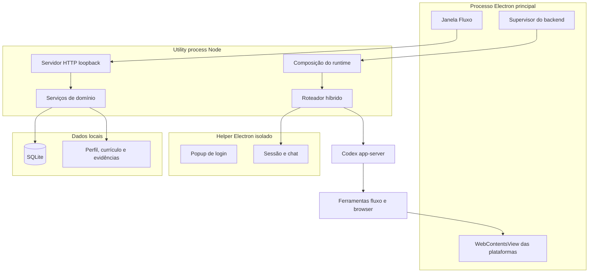

# Arquitetura

## Visão geral

O Fluxo é um monólito modular local-first. Electron hospeda a interface e o
navegador; um utility process executa o backend Node; SQLite e arquivos locais
guardam o estado operacional.

## Processos

### Electron principal

`apps/desktop/desktop/main.cjs` cria a janela, as abas de plataforma e uma porta
CDP aleatória limitada ao loopback. A porta permite que o Playwright opere
somente as páginas do processo principal.

### Backend

`backend-worker.mjs` inicia `runtime-server.mjs` em um utility process. O servidor
HTTP autentica a interface local, serializa mutações e delega regras aos
serviços.

### Helper Skynet

O login e a sessão Skynet vivem em outro processo Electron, com `userData`
próprio e sem CDP. O processo principal conversa com ele por IPC filho-pai. Nem
cookies nem código de acesso atravessam o bridge.

## Roteamento de IA

Com Skynet ativo:

- conversa e perguntas informativas vão ao Skynet;
- campanhas, mudanças locais, navegador e eventos de sistema vão ao Codex;
- sem Codex, pedidos operacionais param e pedem login;
- sem consentimento Skynet, nenhuma mensagem é transmitida.

Com Codex ativo, todos os turnos vão ao Codex.

## Portões de ação externa

Ferramentas de domínio não aprovam ações. Uma ação sensível do navegador:

1. observa página, alvo, conteúdo e fingerprint;
2. solicita aprovação e interrompe a ferramenta;
3. a pessoa decide pela interface autenticada;
4. a ferramenta repete a ação com `approvalId`;
5. o gateway valida hash, versão, expiração e autoria;
6. a página é observada novamente antes de anunciar resultado.

`confirmed=true` não é aceito como autorização.

## Persistência

- `harness.sqlite`: runs, eventos, aprovações e workflow;
- `fluxo.sqlite` ou JSON legado: campanha, fila e candidaturas;
- arquivos privados: currículo, perfil, evidências e configurações;
- `harness.lock`: serialização entre mutações.

Dados de execução ficam fora da instalação e do Git.

## Fronteiras de confiança

- servidor somente em loopback;
- renderer sem Node e com `contextIsolation`;
- páginas externas sem preload do aplicativo;
- ferramentas sem shell, patch ou escrita direta;
- URLs locais/privadas bloqueadas na navegação livre;
- conteúdo de páginas tratado como dado não confiável;
- consentimento explícito antes de provedores externos;
- CAPTCHA, MFA e biometria nunca automatizados.

## Ambientes

- Desenvolvimento desktop: `npm run start:desktop`
- Desenvolvimento web: `npm run start:web`
- Testes: `npm test`, `npm run test:e2e`, `npm run test:desktop`
- Produção: instalador NSIS gerado por `npm run build`

Documentação interna detalhada permanece em `apps/desktop/docs/`.
